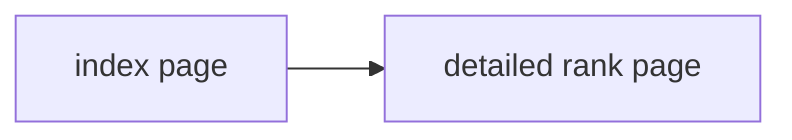
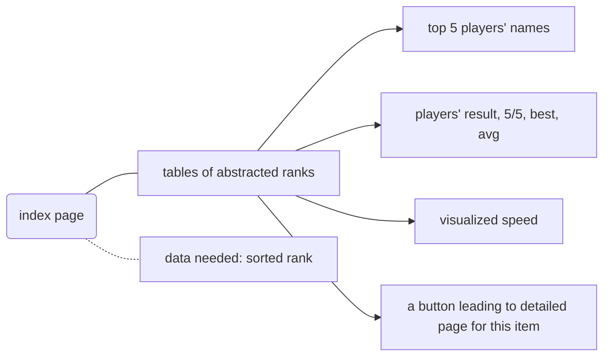
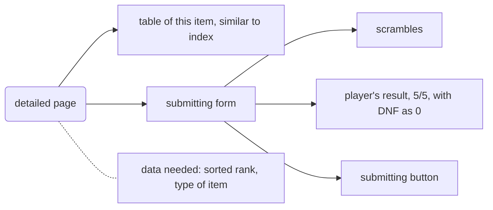

# SCUCA Web计划开发规划

## 开发目标
实现一个魔方周赛网站，每周自动更新打乱

## 技术框架
### 前端技术
1. 全盘采用Vue.js，学习使用Vue-cli脚手架
2. 数据获取：计划使用Django暴露若干接口，在静态页面通过ajax请求数据
### 后端技术
1. 采用drf构建整个后端

## 网站架构
### 整体框架

```mermaid
graph LR
    index[index page] --> detail[detailed rank page]

```
### 细节

```mermaid
graph LR
    index(index page)
    table[tables of abstracted ranks]
    player_names[top 5 players' names]
    player_results[players' result, 5/5, best, avg]
    player_speed[visualized speed]
    button[a button leading to detailed page for this item]
    index --- table
    table --> player_names
    table --> player_results
    table --> player_speed
    table --> button
    index -.- data[data needed: sorted rank]
```

```mermaid
graph LR
    detail(detailed page)
    table[table of this item, similar to index]
    form[submitting form]
    form_head[scrambles]
    form_body[player's result, 5/5, with DNF as 0]
    form_button[submitting button]
    detail --> table
    detail --> form
    form --> form_head
    form --> form_body
    form --> form_button
    detail -.- data[data needed: sorted rank, type of item]
```